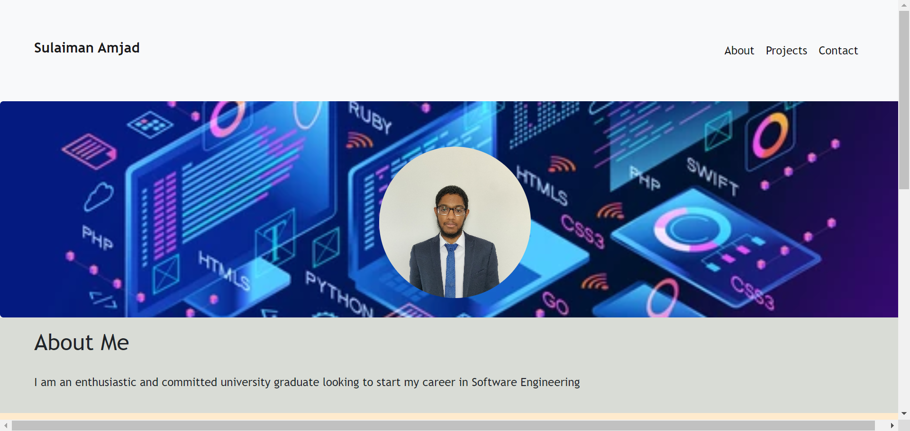

# Portfolio Refactored with Bootstrap

Trilogy Bootcamp Module 3 Challenge - Bootstrap Portfolio

## Description 

This project refactors my personal portfolio. The website includes
- Software Development Projects
- About me
- How to contact me

## Table of Contents (Optional)

* [Installation](#installation)
* [Usage](#usage)
* [License](#license)

## Installation

N/A

## Usage 

Access website at https://sulaiman-ai.github.io/module3-portfolio-bootstrap/

## License

Please refer to the license in the repo.
